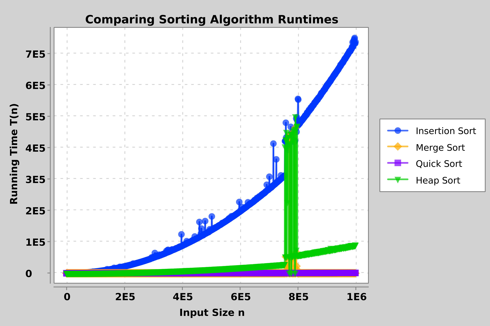

# cs241-project2

My Name: Terence Tan, Matt Jensen

About This Project: implementation of sorting algorithms, comparing run times, and plotting.

## Discussion

Insertion sort is the slowest, Heap sort is the second slowest, Quick sort is the third slowest, and Merge sort is the fastest as n goes towards infinity.

